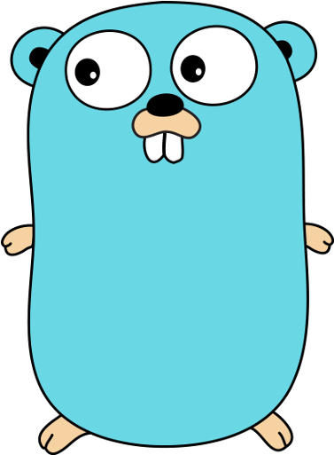

<h1>Go Zero to Hero </h1>

#

It's a sample repository for saving my learning in the Go programing language.

For this learning, I go use the [roadmap](https://roadmap.sh/golang) for my orientation, this YouTube [playlist](https://www.youtube.com/watch?v=WiGU_ZB-u0w&list=PLCKpcjBB_VlBsxJ9IseNxFllf-UFEXOdg&ab_channel=AprendaGo) and other [sites](https://www.google.com/).

#

